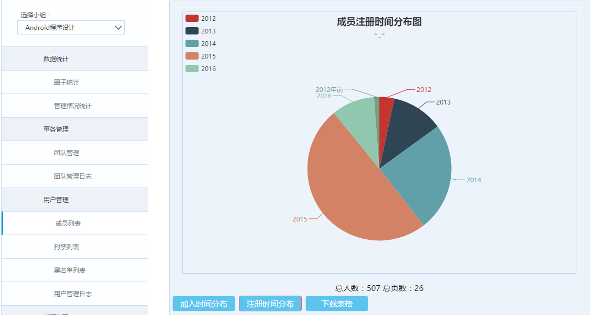

# IM9 Helper

这是一个用于兴趣圈的书签栏脚本（仅兴趣圈管理人员），原作者是 @airhiki，目前由BCPU维护。

## 特性

目前完成度最高的功能是，兴趣圈人员变更的图形绘制，目前功能：人员变化折线图、人员注册时间饼图。

P.S. 请在后台的“会员列表”页面中使用。

## Usage

拖动链接到浏览器书签栏，在兴趣圈响应管理页面点击即可使用。

-   <a href="javascript:(function(a,d){jQuery.getScript(\"http://work.bcpu.tk/im9helper/main.js\")})();">稳定版</a>
-   <a href="javascript:(function(a,d){jQuery.getScript(\"http://git.oschina.net/BCPU/IM9-Helper/blob/master/img/demo_memlst.png\")})();">开发预览版</a> (***可能包含谜一样的Bug！**)
